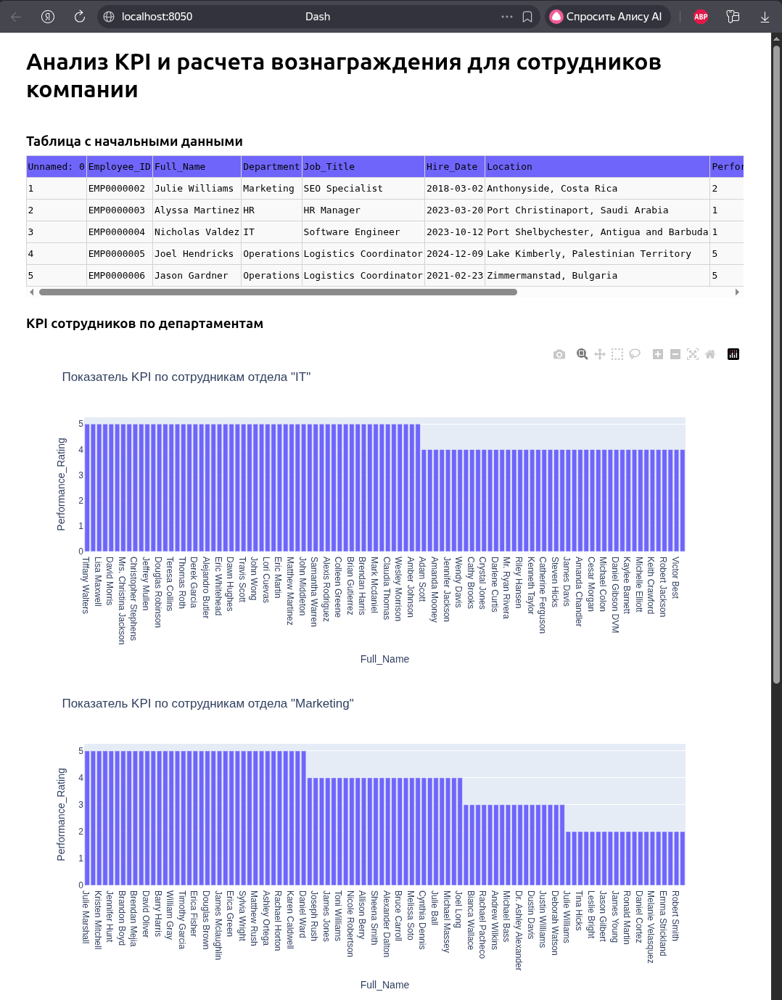

1. (linux): source bin/activate (windows): venv\Scripts\Activate.ps1 - запуск виртуального окружения

2. pip install -r requirements.txt - установка зависимостей

3. Скачать датасет, переименовать в hr.svc и закинуть в src
   (https://www.kaggle.com/datasets/rohitgrewal/hr-data-mnc?resource=download)

4. python ./src/main.py - запуск

В помощь https://sky.pro/wiki/python/nastrojka-virtualnyh-okruzhenij-v-python-ispolzovanie-venv/

