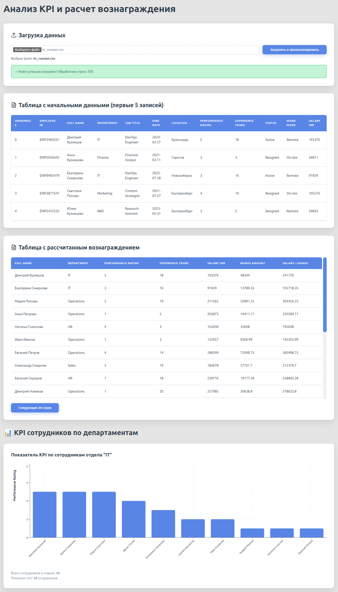

# Инструкция по установке и запуску

\*_Набор собственно сгенерированных данных доступен в datasets.zip_

\*_[Набор данных из kaggle](https://www.kaggle.com/datasets/rohitgrewal/hr-data-mnc?resource=download)_

## Backend (FastAPI)

### 1. Установка зависимостей

```bash
cd backend
python -m venv venv
source venv/bin/activate  # На Windows: venv\Scripts\activate
pip install -r requirements.txt
```

### 2. Запуск сервера

```bash
python main.py
```

Сервер будет доступен на `http://localhost:8080`

API документация: `http://localhost:8080/docs`

## Frontend (React)

### 1. Установка зависимостей

```bash
cd frontend
npm install
```

### 2. Запуск приложения

```bash
npm run dev
```

Приложение будет доступно на `http://localhost:5173`

## Ключевые особенности реализации

### Передача CSV файла от клиента к серверу

**На клиенте:**

- Используется HTML input с `type="file"` и `accept=".csv"`
- Файл оборачивается в `FormData` объект
- Отправляется через `fetch()` с методом POST

```javascript
const formData = new FormData();
formData.append('file', file);

const response = await fetch(`${API_URL}/upload`, {
	method: 'POST',
	body: formData,
});
```

**На сервере:**

- Endpoint принимает `UploadFile` через параметр `File(...)`
- Файл читается и преобразуется в pandas DataFrame
- Данные сохраняются в памяти для последующего использования

```python
@app.post("/api/upload")
async def upload_csv(file: UploadFile = File(...)):
    contents = await file.read()
    df = pd.read_csv(io.BytesIO(contents))
```

### Построение графиков на клиенте

**Библиотека: Recharts**

1. Данные получаются с API в формате JSON
2. Recharts принимает массив объектов
3. Каждый объект представляет точку данных

```javascript
<BarChart data={deptData}>
	<XAxis dataKey='Full_Name' />
	<YAxis />
	<Bar dataKey='Performance_Rating' fill='#4f46e5' />
</BarChart>
```

## Демонстрация


